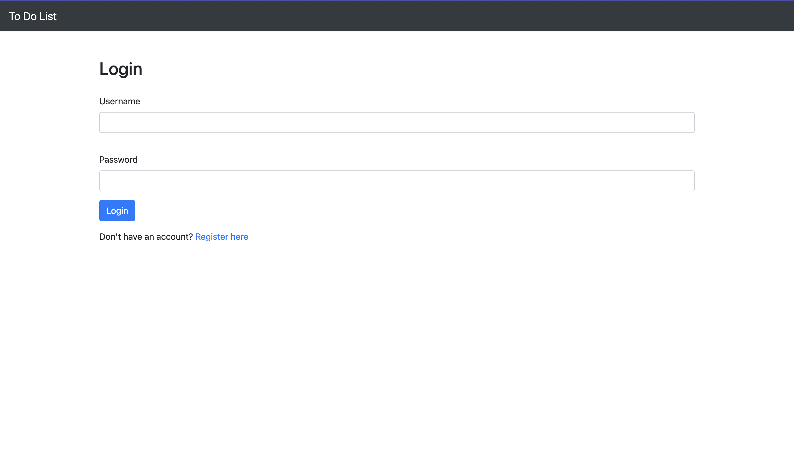

# Todo List Project

## Overview

This is a simple Todo List application built using Django. The project allows users to create, read, update, and delete tasks, providing a user-friendly interface for managing their daily activities.

## Features

- User authentication (login and registration)
- Create, read, update, and delete tasks
- User-friendly interface
- **Search Functionality**: Integrated with Elasticsearch for fast and efficient searching of tasks.
- **Download Feature**: Users can download their tasks in various formats (e.g., PDF, CSV, Excel).
- **Pagination**: The interface includes pagination options, allowing users to choose how many tasks to display per page (25, 50, or 100 tasks).

## Technologies Used

- Django
- HTML/CSS
- JavaScript
- Bootstrap (for styling)
- Elasticsearch: A powerful search and analytics engine for real-time data search.

## Sample Images

Here are some sample images from the project:

1. 
2. 
3. 
4. 
5. 

## Sample PDF

You can also find the sample PDF document included in the project:

- [Sample PDF](sample/pdf.pdf)

To test:
Username: testuser
Password: @Qwertyuiop2